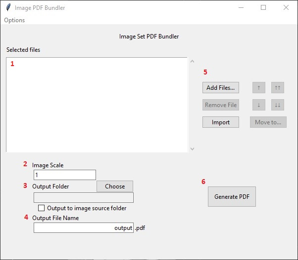

# PDF Image Bundler

This tool is designed to let users create PDF files consisting of full-page images, with each page sized to each image's print resolution (image size / DPI).

## Requirements

- pdflatex
- Python >= 3.11

## Setup

1. Install python requirements

```sh
pip install -r requirements.txt
```

2. Execute python script in terminal

```sh
python images-to-pdf.py
```

## Usage



1. Selected files - List of files selected to be bundled into pdf
2. 