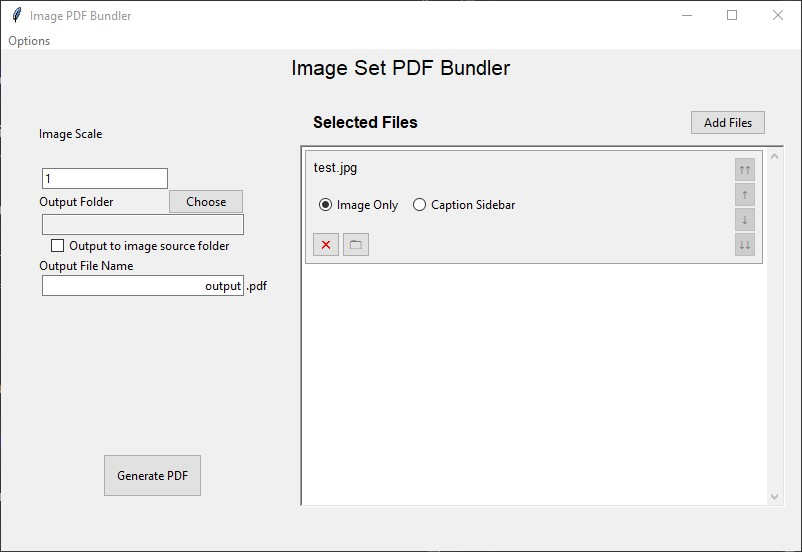

# PDF Image Bundler

This tool is designed to let users create PDF files consisting of full-page images, with each page sized to each image's print resolution (image size / DPI).

I set out to make this because I wanted to "print" a bunch of images to a single PDF file as full-page images, but found using *Print to PDF* was too cumbersome when I was often dealing with images that didn't fit existing paper sizes.

This tool uses LaTeX to generate a PDF file where each page is the exact print size of the image on it. The "Image Scale" field will scale all input image files, so if your images are bigger than the rough page size desired, they can be shrunk down.

Additional features
- Add image captions to page with "Caption Sidebar" layout
  - Loads image caption from IPTC data, can be customized w/o affecting image metadata
  - Sidebar position and width can be modified for each image
- Save and load bundles
  - Save bundle files list, settings, custom captions so bundles can be worked on in multiple sessions

**Planned Features**
- Selecting caption font, text size
- Better look and feel


Screenshot is out of date, will update eventually. 

## Requirements

- xelatex (included in [standard LaTeX distributions](https://www.latex-project.org/get/))
- Python >= 3.11

## Setup

1. Set up virtual environment

```sh
python -m venv venv
```

2. Activate virutal environment
```sh
# for cmd
venv\Scripts\activate.bat
# for powershell
venv\Scripts\Activate.ps1
# for linux/mac
source venv/bin/activate
```

3. Install requirements
```sh
pip install -r requirements.txt
```

4. Install LaTeX packages
```sh
# TODO: Add mintex/texlive command for installing packages
```

5. Execute main python script

```sh
python main.py
```


## Supported Image File Formats

The graphics library used to render the PDF files only supports the following image file formats:
- PNG
- JPEG
  
LaTeX does not support WebP or JFIF files. In order to include them in your PDF:
- For WebP files, use the [WebP converter tools](https://developers.google.com/speed/webp) to convert to PNG (changing the file extension is not enough)
- For JFIF files, simply change the extension to .jpeg or .jpg

